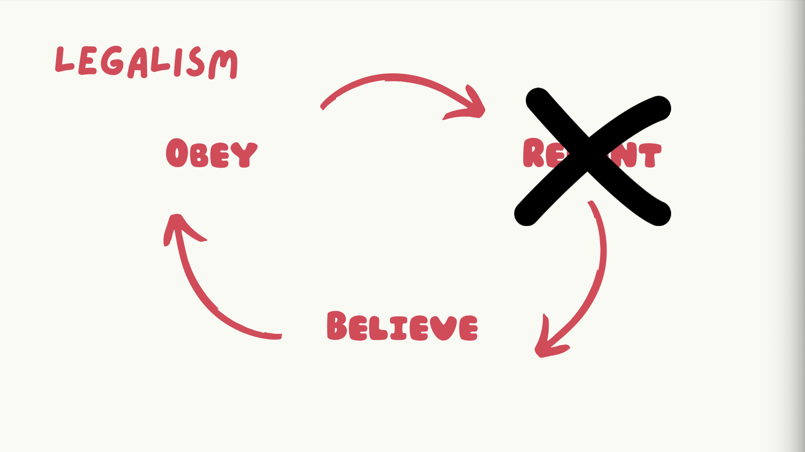

# Communal Life - Gospel Waltz
## Alpha Project Session #6: Elsa Kim

**What is the Gospel Waltz?**
- a <u>tool</u> that gives us framework for <u>transformation</u>
- helps answer the question:
  - How do I <u>grow</u> as a disciple of Jesus?

## Repent
**"If we confess our sins, he is faithful and just to forgive us our sins and to cleanse us from all unrighteousness." 1 John 1:9**
- What sin do I need to confess and repent of?
- What is the sin beneath my sin?
- Why do I love to disobey in this area?
- How is this offensive to God?
- How have I grieved the Holy Spirit?

**Identifying more of our sin should make us more desperate for Christ!**

## Believe
**Take care, brothers, lest there be in any of you an evil, unbelieving heart, leading you to fall away from the living God. Hebrews 3:12**

- What did Jesus do for me regarding this sin?
- How does Christ give me so much more of what I am looking for elsewhere?
- What specific promises of God do I need to believe?

**looking to Jesus, the founder and perfecter of our faith, who for the joy that was set before him endured the cross, despising the shame, and is seated at the right hand of the throne of God. Hebrews 12:2**

- How does Christ love me here?
- How can I rest in Christ’s righteousness and finished work?

## Obey
Belief --> Action
- How is the Holy Spirit moving me towards love and good deeds?
- How am I called to obey in this situation?
- What means of grace do I need?

**How to Apply**
The Waltz is a partner dance, so waltz with God whether it's through prayer or journaling!

**Therefore, confess your sins to one another and pray for one another, that you may be healed. The prayer of a righteous person has great power as it is working. James 5:16**

Waltz with God <u>AND</u> other people!

Our application step in OIJA is an example of these three steps:
1. I own and repent of ________ (REPENT)
2. I look to Jesus, who ________ (BELIEVE)
3. I believe ________ (BELIEVE)
4. Holy Spirit, help me to ________ (OBEY)

**Something to Avoid**
If you’re not experiencing transformation, you are skipping a step!

