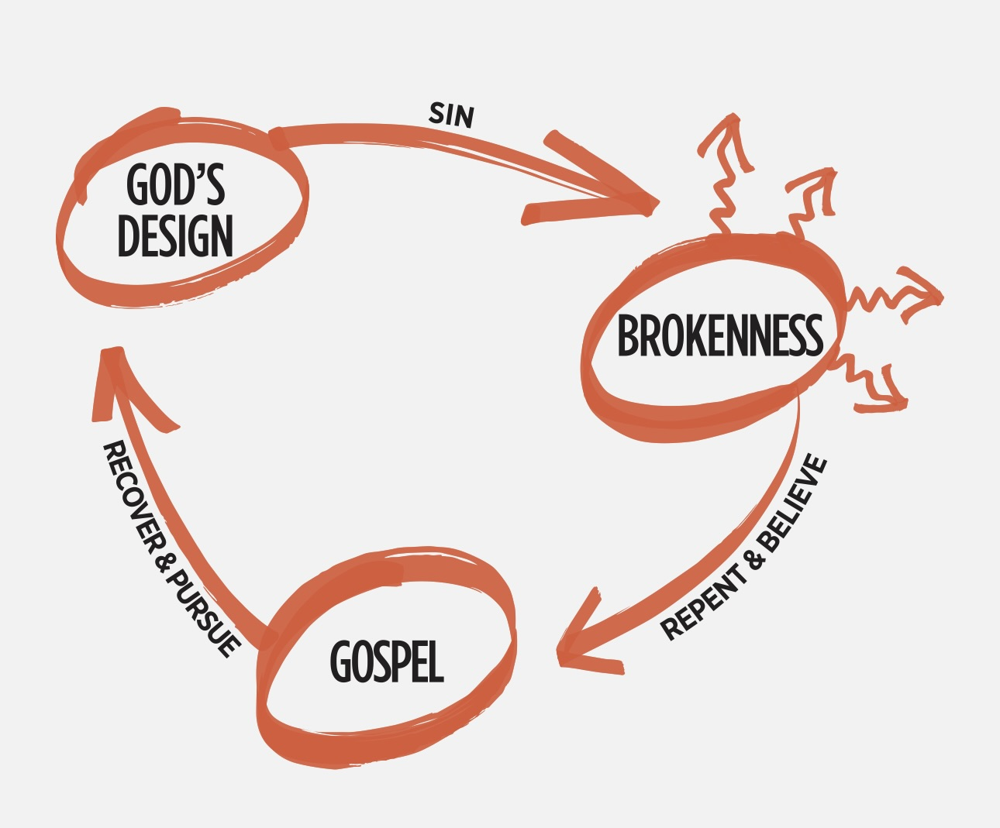

# Missional Life - 3 Circles/Defining a Win
## Alpha Project Session #8: Abby Angalet

This talk was a preface to our time evangelizing at the Temecula Mall. It helped us set a framework and tangible goals to accomplish during our time EV-ing.

**Why?**

**And Jesus came and said to them, “All authority in heaven and on earth has been given to me. Go therefore and make disciples of all nations, baptizing them in the name of the Father and of the Son and of the Holy Spirit, teaching them to observe all that I have commanded you. And behold, I am with you always, to the end of the age.”** Matthew 28:18-20

God calls us to be his laborers.
**Then he said to his disciples, “The harvest is plentiful, but the laborers are few; therefore pray earnestly to the Lord of the harvest to send out laborers into his harvest.”** Matthew 9:37-38

We should have compassion for the people who are lost without ever hearing of the Gospel.
**When he saw the crowds, he had compassion for them, because they were harassed and helpless, like sheep without a shepherd.** Matthew 9:36

**How?**

**God's Design**: We were created in God's image and in perfect relationship with Him. We were designed to worship
and walk with God, and it was <u>very good</u>. **And God saw everything that he had made, and behold, it was very good. And there was evening and there was morning, the sixth day.** Genesis 1:31

**Sin**: entered and the world and the perfect relationship between man and God was broken. **For the wages of sin is death,** Romans 6:23a

**Brokenness**: Sin leads us to a place of brokenness. Brokenness leads us to a place of realizing our need for something greater. **for all have sinned and fall short of the glory of God,** Romans 3:23

**Gospel**: Because of his love for us, God sent his son Jesus to live the perfect human life according to God's design, never giving into sin and to do what we could not do for ourselves - and reconcile us to God. **For the wages of sin is death, but the free gift of God is eternal life in Christ Jesus our Lord.** Romans 6:23

**Repent**: acknowledging and turning from our sin
**Believe**: Trusting that God is who he says he is. By repenting and believing, we receive new life in Jesus and God turns our lives in a NEW DIRECTION.
**because, if you confess with your mouth that Jesus is Lord and believe in your heart that God raised him from the dead, you will be saved.** Romans 10:9
**For by grace you have been saved through faith. And this is not your own doing; it is the gift of God, not a result of works, so that no one may boast.** Ephesians 2:8-9

**Recover & Pursue**: Because of our faith in Jesus, we can return to God’s original design for our lives: to worship him and to walk with him.
**Therefore, if anyone is in Christ, he is a new creation.The old has passed away; behold, the new has come.** 2 Corinthians 5:17
**for it is God who works in you, both to will and to work for his good pleasure.** Philippians 2:13

We defined a win as initiating 2 conversations and asking one spiritual question, and then headed to the Promenade Mall!