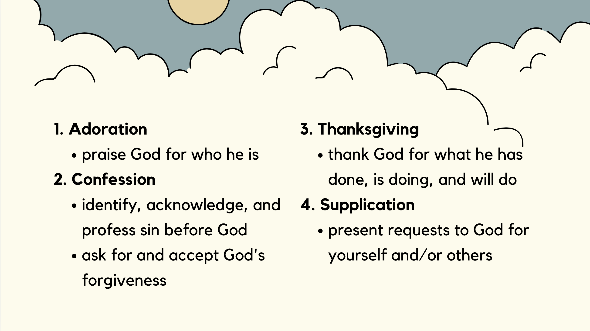

# Devotional Life - How to Pray: ACTS
## Alpha Project Session #5: Emily Xia

1. **What** is prayer? 
2. **Why** should we pray?
3. **How** to pray (ACTS method)

Prayer is:
- communication with God
- not just talking to him, but also with him
- engaging in fellowship with our Creator 

Why should we pray?

“Teacher, which is the great commandment in the Law?” And he said to him, “You shall love the Lord your God with all your heart and with all your soul and with all your mind. This is the great and first commandment." -Matthew 22:36-38
- great and first commandment is to love God
- prayer is a way to develop an intimate relationship with God

Jesus prayed all the time during his life on earth! 
- "But he would withdraw to desolate places and pray." -Luke 5:16
- "And rising very early in the morning, while it was still dark, he departed and went out to a desolate place, and there he prayed." -Mark 1:35
- "In these days he went out to the mountain to pray, and all night he continued in prayer to God." -Luke 6:12

## Prayer Method: ACTS (Adoration, Confession, Thanksgiving, Supplication)

**1. Adoration**
- Adore: worship as divine; love or revere deeply
- praising God for who he is
- Through him then let us continually offer up a sacrifice of praise to God, that is, the fruit of lips that acknowledge his name. -Hebrews 13:15
- “Adoration is the spontaneous yearning of the heart to worship, honor, magnify, and bless God… In the prayer of adoration we love God for himself, for his very being, for his radiant joy.” -Richard Foster
- How to pray prayers of adoration:
  - pray through the psalms(Psalm 8, 40, 96, 103, 111, 117, 145)
  - praise God for creation
  - go for a prayer walk and enjoy nature
  - pray/sing songs of praise
  
**2. Confession**
- an acknowledgement or profession of our sin before God
- opportunity to allow light to expel darkness, and to experience the mercy of God
- "If we say we have no sin, we deceive ourselves, and the truth is not in us. If we confess our sins, he is faithful and just to forgive us our sins and to cleanse us from all unrighteousness. If we say we have not sinned, we make him a liar, and his word is not in us." -1 John 1:8-10
- How to pray prayers of confession:
  - Identify and acknowledge sin in your life
  - Ask God to show you areas of disobedience
  - Ask for forgiveness (even for sins you may be unaware of)
  - pray through Psalm 51

**3. Thanksgiving**
- giving thanks to God for what he has done, is doing, and will do
- "Rejoice always, pray without ceasing, give thanks in all circumstances; for this is the will of God in Christ Jesus for you." -1 Thessalonians 5:16-18
- How to pray prayers of thanksgiving:
  - Thank God for:
    - answered prayers
    - daily provisions
    - the ways he is blessing you
    - even trials!
    - Jesus's sacrifice on the cross is always a good starting place!

**4. Supplication** 
- petitioning or asking God for something
- present requests to God
  - can be for yourself and/or others
- "do not be anxious about anything, but in everything by prayer and supplication with thanksgiving let your requests be made known to God. **And the peace of God, which surpasses all understanding, will guard your hearts and your minds in Christ Jesus.**" -Philippians 4:6-7
- How to pray prayers of supplication
  - Pray for:
    - personal needs
    - needs of others
    - current world events
    - salvation of friends or family 

Summary:
- prayer is communication with God
- it's a way for us to develop an intimate relationship with him 
- ACTS prayer method is a good way to focus our hearts on **who God is** and **what he has done** before we turn our hearts to **asking him for his continued work**

