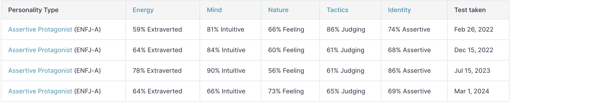

# Life Skills - Finding Your Calling
## Alpha Project Session #9: Ella Lentz

Based off of the book *Garden City* by John Mark Comer.

God & JMC both say that we are made to work!

Your calling isn't something you choose, but something only you unearth.

Your calling is what God made you to do uniquely.

Pratical Tools:
- enneagram tests
  - [Your Enneagram Coach - more specific](https://assessment.yourenneagramcoach.com/) 
  here's mine for example:
  
  - [Truity - general](truity.com)
- myers briggs/MBTI
  - [16personalities](https://www.16personalities.com/free-personality-test) 
  here's mine for example:
  
- strength finders tests

Much of finding your calling is about finding out:
- who you are
- what you <u>alone</u> can contribute to the world

What we do should grow out of who we are:
- if we fight the image of God in us - even if we succeed in the short run - it will come back to eat us alive

Some cool tips & tricks:
1. look up enneagram institute type ___ to learn more about your type (ex. I'm a [type 2](https://www.enneagraminstitute.com/type-2/))
2. look up enneagram ___ iceberg to see if you relate with any of these thoughts (ex. I'm a [type 2](https://ellezimmerman.com/wp-content/uploads/2021/06/Ennea-2-Ice-600x600.png))
3. look up your mbti + enneagram (ex. I'm an [ENFJ 2w3](https://personalityhunt.com/enfj-2w3-the-complete-guide/))

**Questions to help you identify your calling:**
1. what do you love?
2. what are you good at? and bad at?
3. what does your world need?
4. does it make the world a more Garden-like place?
5. what are the open doors in your life?
6. what is God’s blessing?
7. what are the people you know saying?
8. what is the Spirit stirring in your
heart?