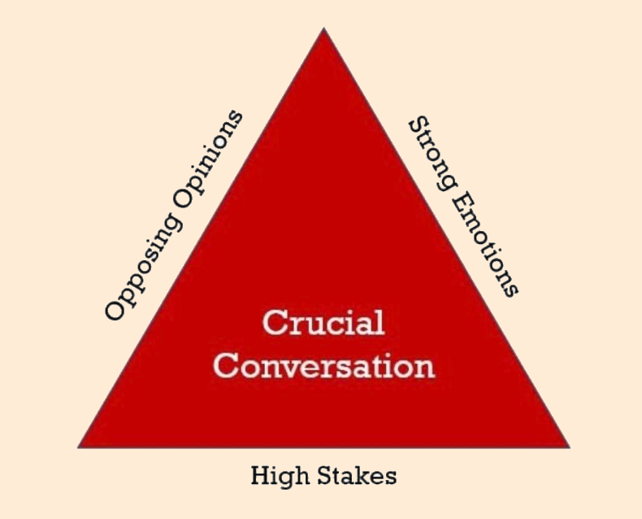
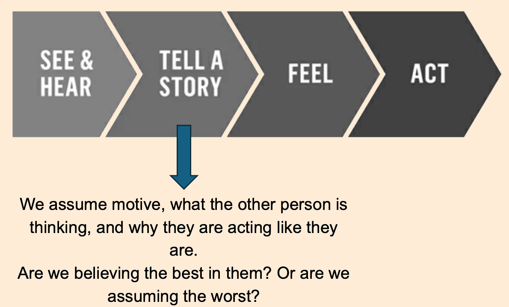

# Communical Life - Crucial Accountability
## Alpha Project Session #13: Berkeley Gomez

What is a crucial conversation?

There is a false dichotomy that says we can only choose one:
1. We can tell the truth
2. We can keep a friend

but in fact, we can tell the truth, hold others accountable to their commitments, AND strengthen the relationship.

### WHAT and IF

We first need to determine:
1. **WHAT** convo needs to happen
    What actually needs to be discussed? What’s the main issue here?
   1. Unbundle – separate the various issues
      - Content – the first time an issue comes up
      - Pattern – not the first time an issue has come up
      - Relationship – an issue is impacting our relationship
      - The issue could also be HOW you’re communicating. Are you too direct? Not direct enough?
   2. Choose – ask “what do I really want?”
   3. Simplify – state simply what you want to discuss
2. **IF** this convo needs to happen
    Determine if this convo needs to happen:
       - Am I acting out my concerns? (sarcastic, harsh, dismissive)
       - Is my conscience nagging me?
       - Am I choosing the certainty of silence over the risk of speaking up?
       - Am I telling myself I’m helpless?

### How we think communication happens

VS

### In reality, we tell ourselves stories

### What story am I telling myself?
Work backwards:
- Am I acting out my concerns rather than talking them out? (act)
- What emotions are encouraging me to act this way? (feel)
- What story is creating these emotions? (tell story)
- What have I seen or heard that supports or conflicts with this story? (see/hear)

### How to craft a better story
Be honest about yourself and give them the benefit of the doubt:
- What am I pretending not to notice about **my** role in the problem?
- Why would a **reasonable, rational, and decent** person do what this person is doing?
- What do I really want for me, for others, and for the relationship?
- What should I do right now to move toward what I really want?

### How to have the convo

STATE your path:
- **S**hare your facts
- **T**ell your story
- **A**sk for their path
- **T**alk tentatively
- **E**ncourage testing

As you listen, remember:
- Ask (express interest in their views)
- Mirror (acknowledge their emotions)
- Paraphrase (restate what you’ve heard them say)
- Prime (if they’re holding back, take your best guess
at what they’re thinking or feeling)

In my distress I called upon the Lord; to my God I cried for help. From his temple he **heard** my voice, and my cry to him **reached** his ears. **Psalm 18:6**

### Overall
- Start with safety (compassion, calm, respect)
- Share you path (what I perceive happened)
- End with a question: “From your perspective, what happened?”

The Lord is near to all who call on him, to all who call on him in truth. **Psalm 145:18**

### What does Jesus say?
*We can initiate because God initiated with us in Christ.*

but God shows his love for us in that while we were still sinners, Christ died for us.**Romans 5:8**

Matthew 18 principles:
1. Keep the circle small. "If your brother sins against you, go and tell him his fault between you and him alone".
2. Be straightforward. "Tell him his fault."
3. Be Forgiving. "If he hears you, you have gained your brother." This implies that once the matter is resolved, we should whole-heartedly forgive and restore the person whose fault has offended us.