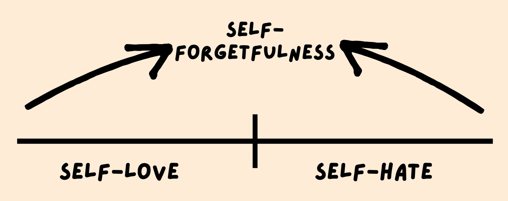

# Leaders Life - Gospel Humility
## Alpha Project Session #18: Elsa Kim

1. The natural condition of the human ego
    - The Ego is **Empty**:
       - we try to fill it with things that will give us a sense of worth
          - success, relationships, money, etc.
      - “If you try to put anything in the middle of the place that was originally made for God, it is going to be too small. It is going to rattle around in there.” -Tim Keller
    - The Ego is **Painful**
      - it draws attention to itself because it is very easily hurt
      - it is bloated and overinflated
    - The Ego is **Busy**
      - preoccupied with comparing itself with others
      - “Pride gets no pleasure out of having something, only out of having more of it than the next person. We say that people are proud of being rich, or clever, or good-looking, but they are not. They are proud of being richer, or cleverer, or better-looking than others. If everyone else became equally rich, or clever, or good-looking there would be nothing to be proud about.”-C.S. Lewis
    - The Ego is **Fragile**
      - “A superiority complex and an inferiority complex are basically the same. They are both results of being overinflated.” -Tim Keller
  Shame only occupies spaces where pride existed first. - Elsa Kim

Our current Cultural Context:
- age of individualism
- self-actualization
- “speaking your truth”
- social media

2. How should we think about ourselves?
    <u>But with me it is a very small thing that I should be judged by you or by any human court</u>. In fact, <u>I do not even judge myself</u>. For I am not aware of anything against myself, but I am not thereby acquitted. <u>It is the Lord who judges me</u>. **1 Corinthians 4:3-4**

    Paul says:
     - it doesn't matter what other people think of me
     - it doesn’t matter what I think of myself
     - **it matters what God thinks of me**

    **GOSPEL HUMILITY**: not thinking more of myself or less of myself, but <u>thinking about myself less</u>

3. How to become Gospel-humble

We become gospel humble by taking ourselves out of the “courtroom” because the trial is over.

There is therefore now no condemnation for those who are in Christ Jesus. **Romans 8:1**

4. What Gospel Humility looks like

**What does Gospel humility look like?**
- invested in others
- not offended or devastated by criticism
- doing things you’d want to do in front of others in private
  - and vice versa

**Discussion Questions**
1. What does your ego hot air balloon look like today?
2. In what areas do you tend to be more self-hating?
3. In what areas do you tend to be more self-loving?
4. What is one way you can practice self-forgetfulness?