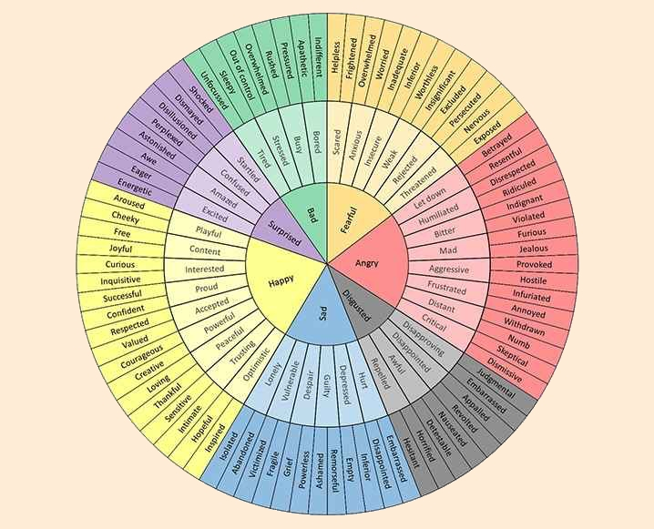

# Communal Life - Untangling Emotions
## Alpha Project Session #19: Abby Angalet

1. What the Bible says about emotions (Theology)
    15 For we do not have a high priest who is unable to
    sympathize with our weaknesses, but one who in every
    respect has been tempted as we are, yet without sin.
    16 Let us then with confidence draw near to the
    throne of grace, that we may receive mercy and find
    grace to help in time of need. **Hebrews 4:15-16**

    **Anger**
    Therefore the anger of the Lord was kindled against his people, and he stretched out his hand against them and struck them, and the mountains quaked;
    and their corpses were as refuse in the midst of the streets. For all this his anger has not turned away, and his hand is stretched out still. **Isaiah 5:25**

    **Sadness**
    33 When Jesus saw her weeping, and the Jews who had come with her also weeping, he was deeply moved in his spirit and greatly troubled. 34 And he said, “Where have you laid him?” They said to him, “Lord, come and see.” 35 Jesus wept. **John 11:33-35**

    **Joy**
    ...for the joy that was set before him endured the cross... **Hebrews 12:2**

    **Grief**
    Then he said to them, “My soul is very sorrowful, even to death; remain here, and watch with me.”**Matthew 26:38**

2. The God-given purpose of our emotions
3. How to include God in our emotions
    **Notice**
    Paying attention to what we’re sensing in our feelings, acknowledging that those feelings are true for us, and remembering when the emotions we’re experiencing first showed themselves in our lives
    
    **Name**
    Now we want to deepen our articulations by categorizing our level of Okayness or Not Okayness with better, richer words

    Joy, Anger, Sad, Fear
    

    **Feel**
    We waste so much energy scrutinizing our feelings rather than just feeling what we need to feel 
    Pause, Give yourself permission, Look back, Persist

    **Share**
    Feelings don’t heal when we ignore them; they heal when we are wrapped up by the people we love in the middle of them

    **Choose**
    Even if you think you aren’t doing anything with your feelings, you are.

    1. God, what do You want me to know?
    2. God what do you want me to do?

The purpose of our feelings are to connect us to God and one another!

"How We Feel" app